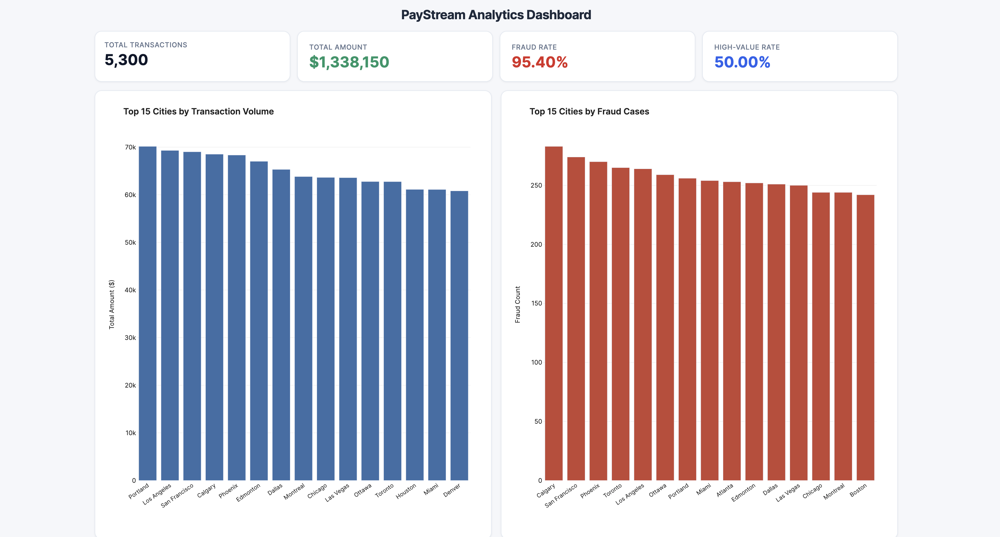

# PayStream

**PayStream** is a real-time data engineering project that simulates, processes, and visualizes credit card transactions — from data generation to analytics — demonstrating how financial institutions monitor transactions, detect fraud, and analyze payment trends.

---

## Overview

PayStream showcases a complete modern data pipeline:

1. Generate synthetic transaction data (using Faker)  
2. Process and clean data with PySpark  
3. Store results in PostgreSQL  
4. Visualize insights with Dash and Plotly  

This project mimics the kind of data flow used by banks and fintech systems for transaction monitoring and fraud detection.

---

## Dashboard Preview

---

## Tech Stack

| Layer | Tools |
|:------|:------|
| Data Simulation | Python, Faker |
| Processing | PySpark |
| Storage | PostgreSQL |
| Visualization | Dash (Plotly) |
| Scheduling (Optional) | APScheduler / Airflow |
| Streaming (Optional) | Apache Kafka |

---

## Project Structure
